# Publishing the Tech Fleet Skills & Practices Framework as Open Data

**A strategy + architecture report — how to take the framework from a private Baserow base to a public, forkable, machine-readable, community-governed open-data product.**

Audience: Tech Fleet leadership (you), plus the engineers who will implement it.
Status: recommendation / teaching document. Nothing here is built yet.
Date: 2026-08-09.

---

## 0. TL;DR (read this first)

1. **Your data is a _knowledge graph / taxonomy_, not an app database.** ~18 entity types, a few thousand rows, richly interlinked, read constantly, written rarely. That classification decides everything downstream. Do **not** architect it like a transactional web app.

2. **The single most important decision: make a public Git repository the canonical source of truth** — flat `JSON` + `CSV` files with a published schema. Git _is_ the fork mechanism (use case 1), _is_ the contribution mechanism (use case 4), _is_ the versioning mechanism, and _is_ a free global CDN. Everything else (APIs, packages, LLM tools) is a **derived read model** you generate from those files.

3. **Baserow is a great _editor_, a poor _public distribution channel_.** Keep authoring in Baserow if you like it — but sync it out to Git and publish from there. Don't hand the world a Baserow API key. (Full reasoning in §6.)

4. **Serve the data as pre-built static JSON on a CDN first** ("static API"). It's free, infinitely scalable, and answers 80% of consumer needs with zero servers. Add a _dynamic_ query API only when static files provably can't answer the questions people ask.

5. **Open the data, sell the convenience.** License the data openly (recommended: **CC BY 4.0** for data, **Apache-2.0** for code/tooling). You can _still_ run a business — by charging for the _hosted service_ (SLA'd query API, LLM/embeddings endpoint, higher rate limits), never for the raw data itself. Don't charge at launch; adoption/standard-setting is worth more than early revenue for a framework play.

6. **You already own most of the infrastructure** (Supabase, Cloudflare Pages, edge functions, a `reference_data_sources` table, a `framework-csv-fetch` function). The recommendation below maps onto what you already run — this is not a big new platform.

Everything below expands these six points and answers your six questions directly (§7–§12).

---

## 1. What I actually read (so this is grounded in your real data)

I read the three articles and the JSON/CSV in `Skills and Practices Framework/`. The framework is a **17-type ontology** (`skills_framework_data_types.json`) plus a **practices-measurement layer**:

**Core entity types** (the "tables"):

| Entity                                                                                                         | Rows (approx, from file size) | Role in the graph                                        |
| -------------------------------------------------------------------------------------------------------------- | ----------------------------- | -------------------------------------------------------- |
| Skills (hard + soft)                                                                                           | large (~250 KB CSV)           | Central node. Rich prose fields.                         |
| Activities / Tasks                                                                                             | large (~164 KB)               | The verbs of work.                                       |
| Duties (Roles)                                                                                                 | ~106 KB                       | RACI-style: Responsible / Accountable / Consulted tasks. |
| Job Functions (Titles)                                                                                         | ~88 KB                        | "Many roles per title."                                  |
| Deliverables                                                                                                   | ~47 KB                        | Outputs of work.                                         |
| Milestones                                                                                                     | ~43 KB                        | Product lifecycle phases.                                |
| Practices                                                                                                      | ~52 KB                        | The 7 team practices.                                    |
| Practices Components                                                                                           | 44 rows                       | Assessment questions → practices.                        |
| Agile Methodologies, Tools, Specializations, Company Types, Industries, Stakeholders, Project Types, Workshops | small                         | Supporting dimensions.                                   |

**The Practices measurement system** (`practices.json` + `practices_components.json`): 7 practices — _Ownership, Empowerment, Service Leadership, Psychological Safety, Agility, Decision-Making, Continuous Growth_ — decomposed into **44 components** (Humility, Trust, Active Listening, Failing Fast…), each with a self-assessment statement and a many-to-many mapping back to practices.

**How records relate.** This is the single most important technical fact for the API design:

> Your relationships are expressed **by name, as string arrays**, not by numeric foreign key.

Example from `skills.json` (the skill "Interviewing"):

```json
"Practices Needed to Improve In This Skill": ["Ownership", "Empowerment", "Service Leadership", "Psychological Safety", "Decision-Making"],
"Activities Involving the Skill": ["Requirements Gathering", "Kickoff / Intake", "Primary Research"],
"Duties Associated With This Skill": ["UX (User Experience) Research"],
"Milestones": ["Continuous Discovery", "Requirements", "Launch", ...]
```

That's the classic Baserow "link to table" export — human-readable, but with **no referential integrity**: rename "Interviewing" and every reference silently breaks. Fixing this is the first engineering task (§4).

**The graph these links form** (this is what makes the data valuable, and what powers your use case #3):

```
Company Type ─┬─> Key Deliverables ──> Tasks/Activities ──> Skills ──> Practices ──> Components (assessment)
              └─> Stakeholders                    ^
Milestone ────> Deliverables ──> Tasks ───────────┘
Duty (Role) ──(RACI)──> Tasks ──> Skills
Job Title ──> Duties/Roles
Skill ──> Tools, Methodologies, Specializations
```

So "what it takes to succeed in a role at a startup vs. an agency" (your career-coaching use case) is a **graph traversal**, not a lookup. The architecture has to make traversal cheap.

**Data-quality issues I noticed** (worth fixing before you publish — see §4):

- `skills.json` carries ~20 empty/duplicate columns: `Transitioning into UX Design copy 2`, `Roles 2`, `Roles 3`, `... copy 3`, etc. Baserow editing cruft. Strip before publishing.
- `skills.json → "Project Phases"` contains **dates** (`"2025-01-06"`, `"2024-12-01"`) — a column that appears mislabeled or misused. Decide what it means or drop it.
- Relationship-diagram images point at **Baserow's private S3** (`baserow-backend-production…s3.amazonaws.com/...`). Those URLs will rot and aren't yours. Re-host diagrams in the repo.
- The data-dictionary's `Relationship to X` fields are all empty strings — the relationship _semantics_ live only in prose. Capture them structurally (§4).

None of this is alarming — it's normal for data that grew inside a spreadsheet tool. But it's exactly the cleanup that separates "a spreadsheet export" from "an open-data product."

---

## 2. The core mental model: _data as a product_, distributed through _derived read models_

The enterprise pattern for open, versioned, forkable reference data is **"spec repo + derived distributions"** (how TZ database, SPDX license list, MDN's browser-compat-data, schema.org, and OpenAPI itself are all run):

```mermaid
flowchart LR
  subgraph A["Authoring (private)"]
    BR["Baserow<br/>(friendly editor)"]
  end
  subgraph SOT["Source of Truth — PUBLIC Git repo"]
    F["/data/*.json + *.csv<br/>+ /schema/*.schema.json<br/>+ LICENSE + CHANGELOG"]
    CI["CI validation:<br/>schema + referential integrity<br/>+ semver check"]
  end
  subgraph D["Distribution — DERIVED read models (auto-built)"]
    CDN["Static JSON API<br/>(CDN: jsDelivr / Pages)"]
    PKG["npm + PyPI packages<br/>(data + typed clients)"]
    QAPI["Dynamic query API<br/>(PostgREST / Workers) — later"]
    LLM["MCP server + embeddings<br/>corpus download — later"]
  end
  subgraph C["Consumers"]
    FORK["Forkers"]
    BOT["Chatbots / LLMs"]
    DEV["Developers / apps"]
    EDU["Instructors"]
  end
  BR -->|"scheduled sync / webhook"| F
  F --> CI
  CI -->|"build on every merge"| CDN & PKG & QAPI & LLM
  FORK -->|"git fork / clone"| F
  DEV --> PKG & CDN
  BOT --> LLM & CDN & PKG
  EDU --> CDN & FORK
```



**Why this shape and not "just expose the Baserow/Supabase API":**

- **The source of truth is text in Git**, so it is diffable, reviewable, forkable, and citable. That single choice delivers use cases 1 (fork), 4 (contribute), and most of 5 (reuse) _for free_, because Git already does forking, pull requests, and versioning.
- **APIs are generated, not authored.** If an API goes down or you change hosting, the data is unaffected — consumers can always fall back to the files. You never have a "the database is the API is the source of truth" single point of failure.
- **You can offer many distribution channels from one source** without maintaining them by hand. Each consumer picks the channel that fits (a data scientist clones the repo; a React app installs the npm package; a chatbot hits the MCP server).

This is also the right call under the "don't over-engineer" rule: the _baseline_ is just files in Git on a CDN — cheaper and simpler than any database-backed API — and you add heavier machinery only where a real consumer need justifies it.

---

## 3. Recommended repository layout

**Recommendation: a _separate, dedicated public repo_** — e.g. `techfleet/skills-practices-framework` — **not** a folder inside `techfleetnetwork`.

Why separate, even though you asked for it to be part of `techfleetnetwork`:

- `techfleetnetwork` is a **production app** with auth, RLS, secrets, ~767 real users, and a locked-down security posture. You do **not** want the public's forks, issues, and pull requests landing on the same repo as your production Supabase app. Different audience, different risk profile, different release cadence.
- A framework that wants to become an _industry standard_ (the vision article's explicit goal) needs a clean, obviously-public, well-licensed home that isn't "a subfolder of somebody's app."
- The app can still _consume_ the framework — as an npm dependency or a git submodule — so it remains "part of" your ecosystem without being tangled into the app repo. (Your existing `framework-csv-fetch` function + `reference_data_sources` table is exactly the seam where the app already treats the framework as an external source it ingests.)

Keep the **strategy doc** (this file) in `techfleetnetwork/docs/framework/`; put the **framework itself** in its own repo. Proposed layout:

```
skills-practices-framework/
├── README.md                     # what it is, how to use, links to docs
├── LICENSE-DATA                  # CC BY 4.0  (the data)
├── LICENSE-CODE                  # Apache-2.0 (schemas, clients, tooling)
├── CHANGELOG.md                  # generated; human-readable version history
├── CONTRIBUTING.md               # how to propose changes / new categories
├── GOVERNANCE.md                 # who decides; the RFC process
├── CODEOWNERS                    # who must review which files
├── data/
│   └── v1/
│       ├── skills.json
│       ├── practices.json
│       ├── practices-components.json
│       ├── activities.json
│       ├── duties.json
│       ├── ... (one file per entity)
│       └── manifest.json         # lists entities, versions, checksums
├── schema/
│   └── v1/
│       ├── skill.schema.json      # JSON Schema per entity (the CONTRACT)
│       ├── practice.schema.json
│       └── ...
├── dist/                          # BUILD OUTPUT (git-ignored or a release asset)
│   ├── api/v1/…                   # pre-built static API (see §10)
│   └── openapi.v1.yaml            # generated OpenAPI spec
├── packages/
│   ├── js/                        # @techfleet/skills-framework (npm)
│   └── py/                        # techfleet-skills-framework (PyPI)
├── tools/
│   ├── sync-from-baserow.mjs      # authoring → repo
│   ├── validate.mjs               # schema + referential-integrity check
│   └── build-api.mjs              # files → static API + packages
├── docs/                          # docs site (GitHub Pages)
└── .github/workflows/             # CI: validate, build, release, publish
```

---

## 4. Step 1 of the actual work: turn the export into a _product-grade dataset_

Before any API, do the data-modeling cleanup. This is small and high-leverage.

1. **Give every row a stable, human-readable ID (a slug).** e.g. skill `interviewing`, practice `psychological-safety`. Slugs never change even when display names do. This is the fix for the rename-fragility of name-based links.
2. **Keep the friendly name links _and_ add resolved IDs.** Publish both: `"practices": ["psychological-safety"]` for machines, `"practicesLabels": ["Psychological Safety"]` for humans. Best of both.
3. **Write a JSON Schema per entity** (`schema/v1/*.schema.json`). This is your **contract** — it defines every field, type, and which fields are link-references. Everything else (validation, TypeScript types, Python types, OpenAPI, docs) is generated from it. Contract-first is the enterprise norm for APIs other people depend on.
4. **Enforce referential integrity in CI.** A validator that fails the build if any `"practices": ["psychological-safety"]` points at an ID that doesn't exist. This is the one guardrail your current data most needs — right now nothing stops a broken link.
5. **Strip the Baserow cruft** (`… copy 2`, `Roles 2/3`, empty columns) and resolve the `Project Phases`-contains-dates issue.
6. **Re-host the relationship diagrams** in the repo (`/docs/diagrams/`), not Baserow's S3.
7. **Separate the _taxonomy_ from any _person-level assessment data_.** The 44 assessment questions (the _instrument_) are fine to publish. Any individual's _answers/scores_ are personal data and must **never** go in the public repo. Keep that boundary bright. (This is the one place data-privacy law is relevant; the taxonomy itself is non-personal.)

Output of Step 1: clean `data/v1/*.json`, a schema, and a green CI validator. You could ship _only_ this and already satisfy use cases 1, 4, and much of 5.

---

## 5. Your six questions, answered directly

### Q1 — How does GitHub get involved?

GitHub is the **backbone of the whole open-data operation**, in six distinct roles:

| Role                       | Mechanism                                                                                                                                         | Serves            |
| -------------------------- | ------------------------------------------------------------------------------------------------------------------------------------------------- | ----------------- |
| Canonical versioned source | The repo's `data/` + `schema/`                                                                                                                    | everyone          |
| **Forking**                | `git fork` / "Use this template"                                                                                                                  | **Use case 1**    |
| **Contribution**           | Pull Requests + `CODEOWNERS` + PR template + CI checks                                                                                            | **Use case 4**    |
| Proposing _new categories_ | GitHub **Issues/Discussions** as a lightweight **RFC** process                                                                                    | Use case 4        |
| Versioned releases         | Git **tags + Releases** = immutable, citable snapshots (add a **Zenodo** hook for an academic **DOI** if instructors/researchers need to cite it) | Use cases 2, 3, 5 |
| Automation                 | **GitHub Actions** = validate → build → publish npm/PyPI → deploy static API                                                                      | everyone          |
| **Free global CDN**        | `raw.githubusercontent.com` and **jsDelivr** serve the files worldwide at no cost                                                                 | Use cases 2, 3, 5 |

In short: GitHub gives you forking, contribution, versioning, CI, _and_ a free CDN out of the box. It is the reason an open-data framework costs almost nothing to run at the start.

### Q2 — What and how should we host?

Host in **tiers**, cheapest-first, and only climb a tier when a real need appears:

| Tier  | What                                                                                    | Where                                                                    | Cost    | When                                              |
| ----- | --------------------------------------------------------------------------------------- | ------------------------------------------------------------------------ | ------- | ------------------------------------------------- |
| **0** | Raw files + **static JSON API** (pre-built)                                             | Git + **jsDelivr** / **Cloudflare Pages** / GitHub Pages                 | ~$0     | **Now.** Covers most consumers.                   |
| **1** | **Packages**: `@techfleet/skills-framework` (npm) + `techfleet-skills-framework` (PyPI) | npm + PyPI (free to publish)                                             | ~$0     | Right after Tier 0.                               |
| **2** | **Dynamic query API** (filter/search/paginate/traverse)                                 | **Supabase + PostgREST** (you already run it) or a **Cloudflare Worker** | low     | Only when static files can't answer real queries. |
| **3** | **LLM surfaces**: hosted **embeddings**, an **MCP server**, a "framework assistant"     | Cloudflare Workers / Deno Deploy / Supabase edge fn                      | low–med | When chatbot/LLM adoption is real.                |
| Docs  | API docs + schema explorer                                                              | GitHub Pages / Cloudflare Pages                                          | ~$0     | With Tier 0/1.                                    |

The point: **you can launch entirely on Tier 0–1 for near-zero cost**, and every heavier tier maps onto infrastructure you _already_ operate (Supabase, Cloudflare, edge functions). No new platform.

### Q3 — How does the data get updated over time (if it's open source)?

A governed **change pipeline** where Git is the source of truth:

1. **Author** either in Baserow (kept as the friendly editor) _or_ by editing files directly.
2. If Baserow: a scheduled **GitHub Action** (or your existing `framework-csv-fetch` pattern, inverted to _push_) exports Baserow → normalizes → opens a PR. Baserow becomes an _input_, Git stays the _record_.
3. Every change is a **Pull Request**. CI runs: JSON-Schema validation + **referential-integrity check** + lint + a semver-impact check.
4. A **maintainer/steward** (via `CODEOWNERS`) reviews and merges. Forks may diverge freely (use case 1); the _canonical_ taxonomy is curated.
5. Merge triggers an **automated release**: bump version, regenerate `CHANGELOG.md`, tag, publish packages, redeploy the static API, fire release webhooks (§11).
6. **New categories of data** (use case 4) go through a short **RFC**: open a Discussion describing the new entity/fields, stewards agree on shape, then the schema + data PR lands. This keeps the ontology coherent instead of sprawling.

**Semantic versioning is the contract with consumers:**

| Bump              | Meaning  | Examples                                                     |
| ----------------- | -------- | ------------------------------------------------------------ |
| **MAJOR** (2.0.0) | Breaking | Remove/rename an entity or a link field; change an ID scheme |
| **MINOR** (1.1.0) | Additive | New entity, new optional field, new rows                     |
| **PATCH** (1.0.1) | Fixes    | Typo, better description, corrected link                     |

Consumers pin `^1` and never get surprised. You publish `v2` alongside `v1`; you don't mutate `v1`.

### Q4 — How do we turn it into a scalable API "library"? (best enterprise practice)

Two different things hide inside the word "library," and you want **both**:

**(a) An installable package** ("library" as a developer means it):

```bash
npm install @techfleet/skills-framework
```

```ts
import { getSkill, skillsForRole, practicesForSkill } from "@techfleet/skills-framework";
const skill = getSkill("interviewing"); // fully typed
const forResearch = skillsForRole("ux-research"); // graph traversal, offline
```

The package ships the JSON **plus generated TypeScript types plus tiny helper/traversal functions**. A Python twin ships dataclasses/pydantic models. This is what "API libraries commonly utilized" really means to developers — they'd rather `install` a typed package than hand-write `fetch()` calls. It works offline, versions cleanly, and needs no server.

**(b) An HTTP API** — and here you choose the _style_ per need:

| Style                                        | Best when                                                              | For your data                                                                                                                       | Verdict                                                                                        |
| -------------------------------------------- | ---------------------------------------------------------------------- | ----------------------------------------------------------------------------------------------------------------------------------- | ---------------------------------------------------------------------------------------------- |
| **Static JSON API** (pre-built files on CDN) | Read-only, cacheable, whole-entity fetches                             | `/api/v1/skills.json`, `/api/v1/skills/interviewing.json`, plus pre-computed indexes like `/api/v1/skills-by-role/ux-research.json` | **Start here.** Free, scales infinitely, no servers.                                           |
| **REST (dynamic)**                           | Filtering, pagination, search, "give me rows where…"                   | **PostgREST/Supabase** auto-generates this from tables                                                                              | Add when static indexes aren't enough.                                                         |
| **GraphQL**                                  | Consumers **traverse the graph** and pick exactly the fields they want | "startup → deliverables → tasks → skills → practices" in one query                                                                  | Strong fit for your **use case 3** (narrative/relationship tools). Add if that demand is real. |
| **gRPC**                                     | Internal, high-throughput service-to-service                           | —                                                                                                                                   | **Skip.** Wrong tool for a public, human-facing, read-mostly dataset.                          |

Best-practice essentials regardless of style: **contract-first** (schema → generated **OpenAPI** → generated clients + docs), **URL-path versioning** (`/v1/`), **cache headers + ETags**, cursor pagination, and consistent error shapes. Generate the OpenAPI spec from your JSON Schema so the docs and typed clients are never hand-maintained or out of date.

**Recommended sequence:** static API + typed packages first (covers most of the world), then a GraphQL or PostgREST layer _only if_ consumers hit the wall of "I need to query/traverse, not download."

### Q5 — Where do webhooks come in, and what's possible?

Webhooks = **"tell me when the data changes so I don't have to poll."** For your use cases:

- **Re-embedding for chatbots (use case 2, the big one).** When you release a new version, fire a webhook to registered LLM/RAG consumers so their bot **re-ingests and re-embeds** and stays current. Without this, every downstream bot slowly goes stale.
- **Authoring → publish trigger.** Baserow can fire a webhook on edit → kick the GitHub Action that syncs and opens a PR.
- **Integrator notifications.** Apps built on the framework (use cases 3, 5) subscribe to "new version" events to invalidate caches or prompt an update.
- **You get GitHub's webhooks for free.** GitHub already emits `release`/`push` events; a consumer can subscribe directly. Also publish an **Atom/RSS feed of `CHANGELOG.md`** and a tiny `/version` endpoint — the zero-effort "poll" fallback for consumers who don't want to run a webhook receiver.

**Don't over-build this.** For launch: GitHub release events + an RSS feed + a `version` file is enough. Build a _first-party_ webhook-subscription service (a table of subscriber URLs, **HMAC-signed** payloads, **retries with exponential backoff + jitter**, idempotency keys, a dead-letter log — the standard resilience patterns) only once you have integrators asking for push. When you do, sign every payload and let subscribers verify — an unauthenticated webhook is a spoofing vector.

### Q6 — When should we start charging? Rate limits?

**Principle: open the data, charge for the _service_.** Open-source/open-data and revenue are not in tension — you monetize the _hosted convenience_, never the raw commons (people can fork the commons, so nobody pays for it, and charging for it contradicts the vision article's "make it open source for anyone").

| Always free                             | Potentially paid (the "convenience layer")                          |
| --------------------------------------- | ------------------------------------------------------------------- |
| Raw data in Git                         | Hosted **dynamic query API** at scale, with an **SLA**              |
| Static JSON on the CDN                  | Hosted **LLM/MCP/embeddings** endpoint                              |
| npm/PyPI packages                       | **Higher rate limits** / burst capacity                             |
| Forking, contributing, self-hosting     | Private support, custom data slices, "certified assessment" tooling |
| Use by learners, educators, individuals | Commercial/enterprise volume use                                    |

**Rate limits apply only to the _dynamic/hosted_ API** — static CDN files don't need per-user limits because the CDN absorbs the traffic. A sane ladder:

| Tier      | Who                   | Limit (example)       |
| --------- | --------------------- | --------------------- |
| Anonymous | no key, by IP         | 60 req/min, 10k/day   |
| Free key  | free sign-up          | 600 req/min, 100k/day |
| Paid      | orgs / production use | negotiated + SLA      |

Implement with a **token-bucket limiter**; return `429` + `Retry-After` + `RateLimit-*` headers so clients back off gracefully.

**When to _start_ charging:** not at launch. Sequence:

1. **Launch fully free** to drive adoption and become the standard — for a framework, network effects beat early revenue (and directly serve the marketability/industry-standard vision).
2. **Instrument usage** (API keys, metering, dashboards) so you can _see_ who depends on what.
3. **Introduce paid tiers only when** (a) real consumers run the _hosted_ API in production, (b) that hosting creates genuine cost/support pressure, and (c) you can clearly separate commercial orgs from learners/educators. Charge the orgs; keep individuals and instructors free.

---

## 6. "Is Baserow's API the best way?" — No, but keep Baserow

You asked specifically. Baserow's premium API/docs are **excellent for internal editing and quick prototypes**, and a poor fit as the _public_ channel:

**Why not the public channel:**

- It couples the whole world to your **private account, plan limits, and uptime** — every external consumer's reliability becomes your Baserow bill and Baserow's SLA.
- It leaks an **editing tool's shape** (Baserow row IDs, field quirks, that name-based linking) as your public contract — you can never refactor your base without breaking consumers.
- **Forking/contribution don't exist** in Baserow the way they do in Git. Use cases 1 and 4 essentially require Git.
- It's **not free to the world** at scale and not built to be a CDN.

**Why keep it:** it's a genuinely nice **authoring surface** for non-technical editors. So use the **headless-CMS pattern**: _edit in Baserow → sync to Git (the published source of truth) → build the public APIs from Git._ Baserow becomes an input to the pipeline, not the pipeline itself. Later, if you'd rather edit in Git directly (with schema validation catching mistakes), you can retire Baserow with zero impact on consumers — because they were never pointed at it.

---

## 7. How each of your five use cases is served

| #   | Use case                                                                    | Primary channel                                                               | Notes                                                                                                                                                                                                                                                                                                     |
| --- | --------------------------------------------------------------------------- | ----------------------------------------------------------------------------- | --------------------------------------------------------------------------------------------------------------------------------------------------------------------------------------------------------------------------------------------------------------------------------------------------------- |
| 1   | **Fork the framework, make their own**                                      | **Git fork** + open data license                                              | Zero work beyond publishing the repo + a permissive license.                                                                                                                                                                                                                                              |
| 2   | **Chatbots anywhere answer with your data**                                 | **Packages + static JSON + embeddings + MCP server**; a downloadable "corpus" | Your prose fields (`Example of the Skill`, `How the Skill is Carried Out Daily`, `Importance`) are _already_ superb LLM/RAG content. Stable IDs + a release webhook keep bots current.                                                                                                                    |
| 3   | **Narrative/relationship tools** (career coach, curriculum, project advice) | **GraphQL** or **pre-computed relationship/index files**                      | The value is the _graph_: startup→deliverables→tasks→skills (career coaching), milestones→deliverables→tasks→skills (project advice), skills→duties→roles (curriculum). Your `company_types` already carry `Key Project Deliverables` + `Stakeholders` — the coaching use case is _directly_ in the data. |
| 4   | **Contribute new categories**                                               | **Pull Requests + RFC** (Issues/Discussions) + `CODEOWNERS` + CI              | Governance (§Q3) keeps additions coherent.                                                                                                                                                                                                                                                                |
| 5   | **Apps/LLMs/companies build on it (open or licensed)**                      | **Dual license** (§8) + packages + hosted API                                 | Open data + paid _service_ lets both a hobbyist and an enterprise use it on appropriate terms.                                                                                                                                                                                                            |

---

## 8. Licensing — a concrete recommendation

You said you prefer open source. For _data_, "open source" specifically means an **open-data license** (software licenses like MIT don't cleanly apply to data). Recommendation:

- **Data → Creative Commons Attribution 4.0 (CC BY 4.0).** Permissive; anyone can use/remix/commercialize **if they credit Tech Fleet**. Attribution is a feature, not a tax: every downstream use propagates the Tech Fleet name — which _is_ the marketability/standard-setting flywheel from the vision article.
- **Code (schemas, clients, tooling) → Apache-2.0.** Permissive + an explicit patent grant (slightly safer than MIT for something meant to be widely adopted).

**The one real fork in the road — copyleft or not:**

| Option                      | Effect                                                            | Choose if…                                                                                                          |
| --------------------------- | ----------------------------------------------------------------- | ------------------------------------------------------------------------------------------------------------------- |
| **CC BY 4.0** (recommended) | Anyone may build closed/commercial products on it, must attribute | You want **maximum adoption** and to become the default standard.                                                   |
| **CC BY-SA 4.0** / **ODbL** | Derivatives of the _data_ must stay open ("copyleft for data")    | You want to guarantee improvements flow back to the commons, and accept it will scare off some commercial adopters. |

For a framework whose goal is to _become the industry standard_, **CC BY 4.0 is the stronger choice** — friction kills standards. Add a short `NOTICE`/attribution guide so people know how to credit you (e.g., "Skills & Practices Framework by Tech Fleet, CC BY 4.0, vX.Y").

Add a light **contributor agreement**: a **DCO** (Developer Certificate of Origin — a `Signed-off-by` line, no paperwork) is the low-friction norm and enough for most open projects; a full CLA is heavier and usually unnecessary here.

---

## 9. Phased roadmap (crawl → walk → run)

| Phase                                | Deliverable                                                                                                | Effort     | Cost    | Unlocks                                      |
| ------------------------------------ | ---------------------------------------------------------------------------------------------------------- | ---------- | ------- | -------------------------------------------- |
| **0 — Clean**                        | Slugs, JSON Schema, referential-integrity validator, strip cruft, fix `Project Phases`, re-host diagrams   | ~1 week    | $0      | A trustworthy dataset                        |
| **1 — Publish**                      | Public repo, dual license, README/CONTRIBUTING/GOVERNANCE, CI, first tagged release                        | days       | $0      | **Use cases 1, 4**; forking + contribution   |
| **2 — Distribute**                   | Static JSON API on CDN + pre-computed indexes + npm/PyPI packages with typed clients + OpenAPI + docs site | ~1–2 weeks | ~$0     | **Use cases 2, 3, 5** for most consumers     |
| **3 — LLM-native**                   | Downloadable corpus, hosted embeddings, **MCP server**, release webhook for re-embedding                   | ~1–2 weeks | low     | **Use case 2** at full power                 |
| **4 — Query & govern at scale**      | Dynamic REST/GraphQL (PostgREST/Worker), API keys, metering, rate limits, RFC process formalized           | as needed  | low–med | **Use case 3** power users; the paid tier    |
| **5 — Monetize (only if warranted)** | Paid tiers + SLA on the hosted service; free forever for the data                                          | as needed  | —       | Sustainable revenue without closing the data |

You get real value at the end of **Phase 1**, and cover the large majority of consumers by **Phase 2** — all at ~$0. Everything past that is demand-driven.

---

## 10. What "static API" looks like concretely (so it's not abstract)

At build time, from `data/v1/*.json`, generate a tree of files and push to the CDN:

```
/api/v1/manifest.json                     # version, entity list, checksums
/api/v1/skills.json                        # all skills
/api/v1/skills/interviewing.json           # one skill, fully resolved
/api/v1/practices.json
/api/v1/practices/psychological-safety.json
/api/v1/practices-components.json          # the 44 assessment items
/api/v1/indexes/skills-by-role/ux-research.json
/api/v1/indexes/deliverables-by-company-type/startup.json
```

A consumer just does `GET https://cdn.…/api/v1/skills/interviewing.json`. It's globally cached, costs ~nothing, can't be knocked over, and needs no auth or rate limiting. That single technique covers a large fraction of use cases 2, 3, and 5 before you ever run a server.

---

## 11. Cross-checks (the engineering standards this has to meet)

Because this becomes a contract others depend on:

- **Contract-first & versioned** — JSON Schema is the source; OpenAPI + typed clients are generated; `/v1/` never breaks (enterprise API discipline).
- **Referential integrity in CI** — the guardrail your name-based links currently lack.
- **Resilience for any push/webhook** — HMAC signatures, retries w/ backoff + jitter, idempotency keys, dead-letter logging.
- **Observability before charging** — you can't price or rate-limit what you can't measure; add API keys + metering before Phase 5.
- **Right-sized** — start as files on a CDN; add databases/servers only where a proven consumer need justifies the complexity. (Explicitly _not_ building gRPC, a message bus, or a bespoke webhook platform on day one.)
- **Privacy boundary** — publish the _taxonomy and the assessment instrument_; never publish any individual's assessment _responses_.

---

## 12. Recommended immediate next steps

1. **Decide the repo home** — I recommend a new public `techfleet/skills-practices-framework` repo (reasons in §3). Confirm and I'll scaffold it.
2. **Approve the licensing** — CC BY 4.0 (data) + Apache-2.0 (code), CC BY (not SA). Say the word if you'd rather go copyleft.
3. **Let me do Phase 0** on the data you gave me: generate slugs + JSON Schemas + a referential-integrity validator, and produce a cleaned `data/v1/` set from your current JSON — with a report of every link that currently doesn't resolve and every column I dropped.
4. Then **Phase 1–2**: scaffold the repo, CI, static API build, and the npm/PyPI packages.

I can start on #3 immediately from the files in `Skills and Practices Framework/` — it's the highest-leverage, lowest-risk piece and it makes everything after it concrete.

```

```
